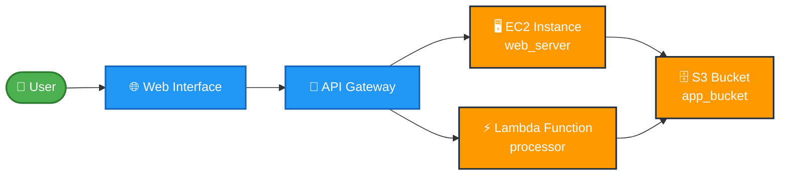

# Infrastructure Diagram

```mermaid
flowchart LR
    User([👤 User]) 
    
    ec2_web_server[🖥️ EC2 Instance<br/>web_server]
    lambda_processor[⚡ Lambda Function<br/>processor]
    s3_app_bucket[🗄️ S3 Bucket<br/>app_bucket]

    Interface[🌐 Web Interface]
    API[🔗 API Gateway]
    
    User --> Interface
    Interface --> API
    
    API --> ec2_web_server

    API --> lambda_processor

    ec2_web_server --> s3_app_bucket

    lambda_processor --> s3_app_bucket


    classDef aws fill:#FF9900,stroke:#232F3E,stroke-width:2px,color:#fff
    classDef user fill:#4CAF50,stroke:#2E7D32,stroke-width:2px,color:#fff
    classDef interface fill:#2196F3,stroke:#1565C0,stroke-width:2px,color:#fff
    
    class User user
    class Interface,API interface
    class ec2_web_server aws
    class lambda_processor aws
    class s3_app_bucket aws
```